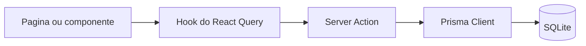

# Arquitetura

## Fluxo de alto nivel

Pagina client (React, App Router)
  -> hook do React Query
  -> Server Action ("use server")
  -> Prisma query
  -> SQLite DB

Esse fluxo e usado para listagens e detalhes de produtos, receitas e historias.

## Limites de runtime

- Client Components: paginas e componentes interativos ("use client").
- Server Actions: buscam dados para os clients.
- API Routes: pontos de integracao e CRUD (protegidas por API_KEY).
- Prisma: camada de acesso ao banco.

## Diretorios chave

- `src/app/(pages)`: rotas publicas (home, secoes, detalhes).
- `src/app/actions`: server actions consumidas por hooks.
- `src/app/api`: endpoints REST usados por chatbot/integracoes.
- `src/hooks`: React Query hooks.
- `src/components`: UI e componentes de feature.
- `prisma/schema.prisma`: modelo de dados.

## Pontos transversais

- Autenticacao API: middleware checa `API_KEY` na maioria das rotas `/api/*`.
- Serializacao Decimal: Prisma Decimal deve virar number nas server actions.
- Midia: produto/receita/historia usam tabelas de juncao.
