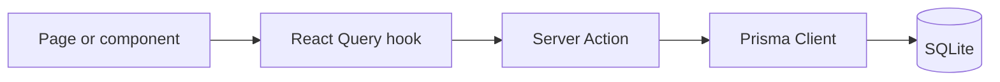

# Architecture

## High-level flow

Client page (React, App Router)
  -> React Query hook
  -> Server Action ("use server")
  -> Prisma query
  -> SQLite DB

This pattern is used for product, recipe, and story listings and details.

## Runtime boundaries

- Client Components: interactive pages and components (marked "use client").
- Server Actions: fetch data for client components.
- API Routes: external integration points and CRUD endpoints (protected by API_KEY).
- Prisma: database access layer.

## Key directories

- `src/app/(pages)`: public routes (home, sections, detail pages).
- `src/app/actions`: server actions consumed by hooks.
- `src/app/api`: REST endpoints used by chatbot/integrations.
- `src/hooks`: React Query hooks wrapping server actions.
- `src/components`: UI components and feature modules.
- `prisma/schema.prisma`: data model.

## Cross-cutting concerns

- API auth: middleware checks `API_KEY` header for most `/api/*` routes.
- Decimal serialization: Prisma Decimal must be converted to number in server actions.
- Media links: product/recipe/story media are modeled via join tables.
