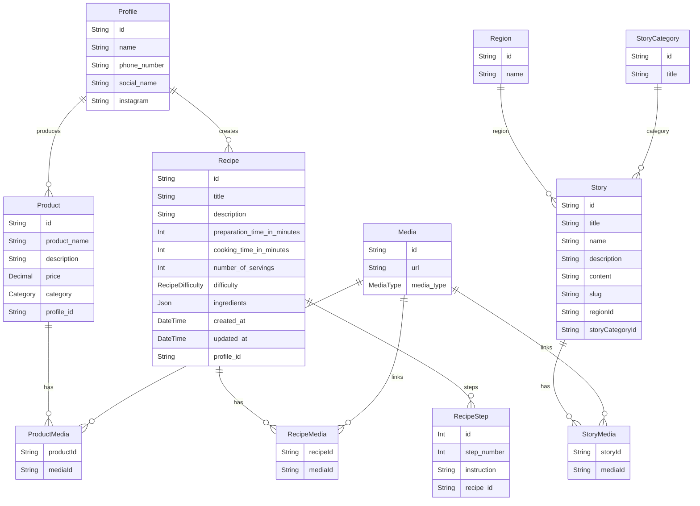

# Data Model (Prisma)

File: `prisma/schema.prisma`

## ER diagram

## Core models

### Profile
- id: String (UUID)
- name: String
- phone_number: String (unique)
- social_name: String?
- instagram: String?
- relations: products, recipes

### Product
- id: String (UUID)
- product_name: String
- description: String?
- price: Decimal?
- category: Category (enum)
- profile_id: String (FK -> Profile)
- relations: media (via ProductMedia)

### Recipe
- id: String (UUID)
- title, description: String
- preparation_time_in_minutes, cooking_time_in_minutes: Int
- number_of_servings: Int
- difficulty: RecipeDifficulty (enum)
- ingredients: Json (array stored as JSON)
- created_at, updated_at: DateTime
- profile_id: String (FK -> Profile)
- relations: steps (RecipeStep), media (via RecipeMedia)

### RecipeStep
- id: Int (autoincrement)
- step_number: Int
- instruction: String
- recipe_id: String (FK -> Recipe)

### Story
- id: String (UUID)
- title, name, description, content: String
- slug: String (unique)
- regionId: String (FK -> Region)
- storyCategoryId: String (FK -> StoryCategory)
- relations: media (via StoryMedia)

### StoryCategory
- id: String (UUID)
- title: String
- relations: stories

### Region
- id: String (UUID)
- name: String
- relations: stories

### Media
- id: String (UUID)
- url: String
- media_type: MediaType (enum)
- relations: ProductMedia, RecipeMedia, StoryMedia

## Join tables

- ProductMedia (productId + mediaId)
- RecipeMedia (recipeId + mediaId)
- StoryMedia (storyId + mediaId)

## Enums

- Category: AGRICOLA | ARTESANATO | PROCESSADO
- MediaType: AUDIO | IMAGE | VIDEO
- RecipeDifficulty: EASY | INTERMEDIARY | HARD

## Notes

- All FKs use cascade delete.
- Decimal values (price) must be serialized to number for client use.
